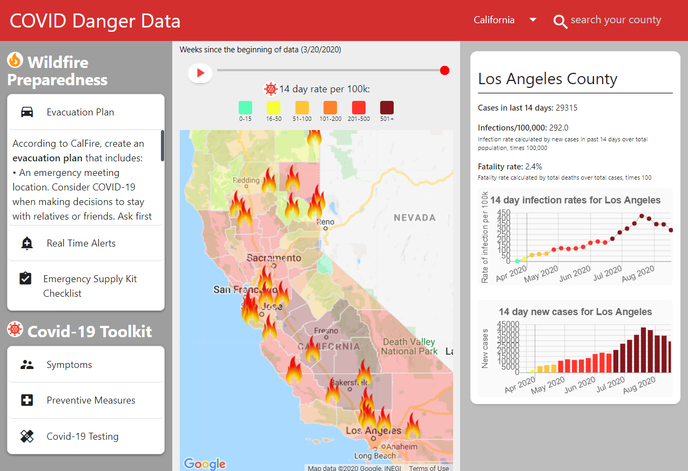

# Covid Danger Data

Find the deployed project [here](https://clydebaron2000.github.io/Covid Danger Data/).

Table of Contents:

- [Section 1: Introduction](#Introduction)
- [Section 2: User Story](#user-story)
- [Section 3: APIs](#APIs)
- [Section 4: Resources](#Resources)
- [Section 5: Creation Team](#creation-team)
- [Section 6: License](#License)

## Introduction

As California enters it's peak during the annual wildfire season, there is added complexity and pressure to plan ahead given the current state of the Covid-19 outbreak. Families who are forced to evacuate will need an emergency plan. This project seeks to deliver a simple app that leverages data from a variety of APIs to deliver up to date visuals of Covid-19 and wildfire situations in California. It features a clean, user interactive map, indicating Covid-19 hotspots and allows users to make informed decisions on where to evacuate to.

## User Story

As a family with members at risk for Covid-19, we want to know which areas in the state we can safely evacuate to during a wildfire, so we can make informed decisions and evacuate accordingly. 

## APIs

### [California Open Data Portal](https://data.ca.gov/dataset/covid-19-cases)
* Used to retrieve Covid-19 data by county and state
* please note that due to unacceptably long wait times to return queries from Covid Tracking Project, this project relies on a CSV to API hosting solution that delivers the same up to date information from a different query address.

### [The United States Census Bureau](https://www.census.gov/data/developers.html)
* Used for population data at state and county levels

### [CalFire](https://fire.ca.gov):
* Used for location and containment status of wildfires

### [CSV to API](https://github.com/project-open-data/csv-to-api)
* Used to serve up JSON from CSV sources (covid)

## Usage ##

The source files for this quiz can be accessed through cloning the GitHub repo. The link above will take you to the deployed project. All APIs used can be accessed by developers applying for free API keys. The Google maps API is only free up to a certain amount of usage, based on a credit they apply monthly to accounts.

## Resources
### Resources from [CalFire](https://www.readyforwildfire.org/):
* Prepare for Wildfire Action Plan
* Emergency Supply Kit
* Alerts 

### Resources from [California Department of Public Health](https://covid19.ca.gov/):
* Emergency Supply Kit
* Alerts 

### Resources from [CDC](https://www.cdc.gov):
* Covid 19 Symptoms
* Covid health information

## Creation Team:
- [Clyde Baron Rapinan](https://github.com/clydebaron2000)
- [Jeneth Diestra](https://github.com/jen6one9)
- [Nancy Lambert-Brown](https://github.com/n-lambert)
- [Plover Brown](https://github.com/rebgrasshopper)

## License
* [GNU](LICENSE)
